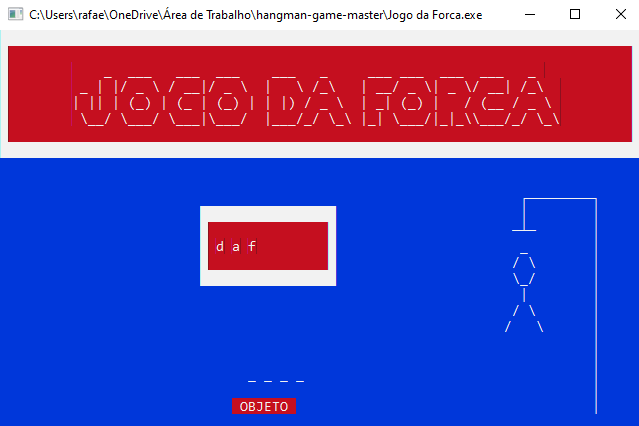

<h1 align="center">
   
  
   
  Hangman Game
   
</h1>

O game possui o objetivo de simular uma interface gráfica de um jogo através de movimentos dos caracteres especiais contidos na tabela ASCII para obteção de desenhos e de uma espécie de interface gráfica.

O jogo foi criado para fins didáticos utilizando o `DevC++` quando eu estava aprendendo C, então peço desculpas por "bad code", o código é livre para edição e reutilização, podendo ser editado e melhorado. Por favor se houver qualquer bug pode me avisar em um dos contatos abaixo!

> Jogo feito no Windows, se tentar compilar no Linux vai precisar da biblioteca `windows.h`

> Caso precise da biblioteca `conio.c` ou `conio.h` clique [aqui](bibliotecas), no DevC++ bibliotecas devem ser inseridas neste diretório: 
> 
> `Dev-Cpp/MinGW32/include/`

|  |  |
|-----------------------------------------------------------|------------------------------------------------------|

## Execução
O jogo só funciona corretamente no Windows ou através do [Wine](https://pt.wikipedia.org/wiki/Wine), para executar o jogo execute [`Jogo da Forca.exe`](Jogo%20da%20Forca.exe). Para navegar nos menus utilize `w`,`a`,`s`,`d` e `Enter`. Note que o `Caps Lock` pode precisar ser ativado.

## Contribuir
Contribuições são o que tornam a comunidade de código aberto um lugar incrível para aprender, inspirar e criar. Todas as contribuições que você fizer são muito bem vindas!
O código está disponível [aqui](code), uma das versões é a correta, eu não tenho certeza qual é e fiquei com preguiça de testar :D

## Autor
* Mauricio Taffarel - [taffarel55](https://github.com/taffarel55)

## Licença
[MIT](LICENSE)
